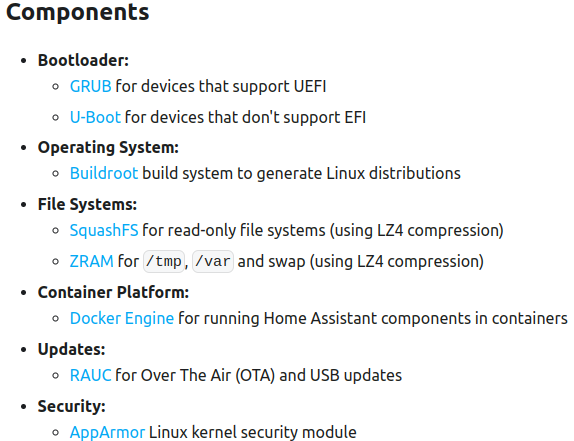

HA 本身可以是个应用也可以是个操作系统，本文实践从零构建 HA 操作系统。

HA 整个操作系统由 Bootloader、Operating System、File System、Container Platform、Updates、Security 组成。我们知道，Bootloader、Operating System(Kernel)、File System 是操作系统的基础，那 Container Platform 的功能是什么？



HA 操作系统本身是[开源](https://github.com/home-assistant/operating-system/)的，使用 Docker 运行 Buildroot，所以构建前确保本机已经装了docker。编译出来的HA操作系统可以运行在树莓派上。

```shell
git clone https://github.com/home-assistant/operating-system/
cd operating-system/
git submodule update --init
```

开始编译

```shell
sudo scripts/enter.sh make rpi4_64
```


构建需要几十分钟，构建输出在``./output``，镜像在``./output/images/``。

上面说到 HA 使用 Docker 构建系统，那构建结果为什么在宿主机上呢？原因是``enter.sh``将容器内的``/build``挂载到了宿主机的``${pwd}``。

想进构建的容器里看看怎么办？``sudo scripts/enter.sh``就行。


# 参考

1. https://developers.home-assistant.io/docs/operating-system
