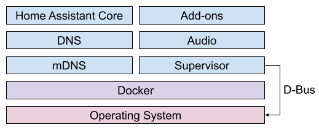
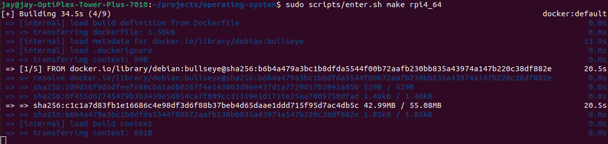
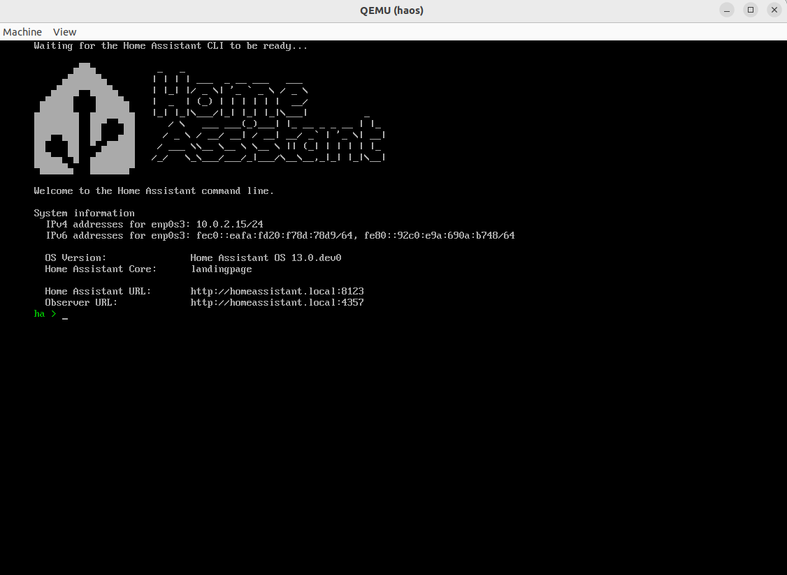
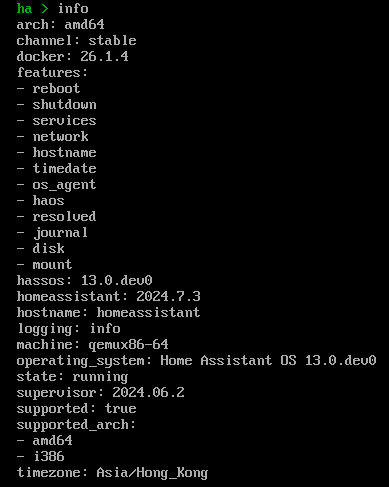
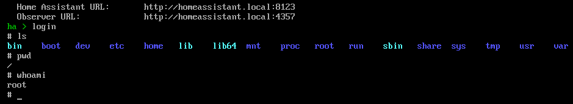

HA (Home Assistan) 主要有三个重要的部分：

- Operating System - 提供了最基本的 Linux 环境来运行 Supervisor 和 Core
- Supervisor - 管理操作系统
- Home Assistant Core - 与用户、Supervisor以及物联网设备和服务进行交互



HA 操作系统本身是[开源](https://github.com/home-assistant/operating-system/)的，使用 Docker 运行 Buildroot，所以构建前确保本机已经装了docker。编译出来的HA操作系统可以运行在树莓派上。

```shell
git clone https://github.com/home-assistant/operating-system/
cd operating-system/
git submodule update --init
```

开始编译

```shell
sudo scripts/enter.sh make rpi4_64
```



构建需要几十分钟，构建输出在``./output``，镜像在``./output/images/``。

上面说到 HA 使用 Docker 构建系统，那构建结果为什么在宿主机上呢？原因是``enter.sh``将容器内的``/build``挂载到了宿主机的``${pwd}``。

想进构建的容器里看看怎么办？``sudo scripts/enter.sh``就行。

# 测试镜像

先在虚拟设备上测试一下镜像。

首先构建一个虚拟设备上运行的镜像：

```shell
sudo scripts/enter.sh make O=output_ova ova
cd output_ova/images/
sudo unxz haos_ova-13.0.dev0.qcow2.xz
```

解压后目录下生成了 `haos_ova-13.0.dev0.qcow2` 就是我们要的镜像文件。

`qcow2` 是一种虚拟机的镜像格式，可以跑在 `QEMU` 虚拟机上。

安装 `QEMU` 虚拟机：

```
sudo apt update
sudo apt install qemu-system-x86 -y
```

使用 `QEMU` 模拟一个 x86_64 架构的虚拟机，指定磁盘映像为我们刚刚打出来那个：

```shell
sudo qemu-system-x86_64 \
	-enable-kvm \
	-name haos \
	-smp 2 \
	-m 1G \
	-drive file=haos_ova-13.0.dev0.qcow2,index=0,media=disk,if=virtio,format=qcow2 \
	-drive file=/usr/share/OVMF/OVMF_CODE.fd,if=pflash,format=raw,readonly=on
```

有可能你的 `OVMF_CODE.fd` 跟我的目录不一样，可以通过 `find / -name "OVMF_CODE.fd" 2>/dev/null
/usr/share/OVMF/OVMF_CODE.fd` 找一下。

运行成功会弹出虚拟机窗口：



`QEMU` 启动后会占领键盘和鼠标的输入，使用 `Ctrl + Alt + G` 释放。

看见 `ha >` 标识符代表 HAOS 启动成功，此时访问 `http://homeassistant.local:8123/` 即可使用 HA。

`info` 查看 HA 的版本信息：



在 `ha >` 模式下，键入 login 即可进入 root shell。




# 参考

1. https://developers.home-assistant.io/docs/architecture_index/
1. https://developers.home-assistant.io/docs/operating-system
1. https://developers.home-assistant.io/docs/supervisor
1. https://developers.home-assistant.io/docs/architecture/core
